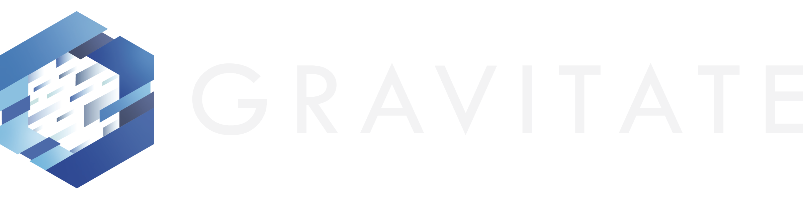

# AI-Enhanced Development
## The New Reality

From 30-Minute Standups to 5-Minute Updates

  Jim Vogel 
  Lead Developer @ Gravitate

  Press Space to continue

<!--
Start strong with the standup story - it's relatable and immediately shows value.
Let them know this isn't about replacing people, it's about amplifying capabilities.
-->

---
transition: fade-out
layout: center
---

# What if I told you...

<v-click>

## We reduced our daily standups from 30 minutes to 5?

</v-click>

<v-click>

## And made them MORE effective?

</v-click>

<v-click>

## With an AI that never forgets to ask for updates?

</v-click>

<!--
Build suspense here. Each click reveals more.
This is your hook - make them want to know HOW.
Set the tone: practical, real results, not sci-fi.
-->

---
transition: slide-up
---

# The Standup Bot Story

## Before AI 🥱
- 30-minute daily standups
- Chasing updates manually
- Forgetting to update tickets
- Context switching disruption
- Team frustration

## After AI 🚀
- 5-minute sync-ups
- Automated Jira watching
- Slack reminders at day's end
- Morning summaries ready
- Listen during coffee ☕

Result: 25 minutes saved daily × 5 devs = 10+ hours/week

<!--
This is a concrete example they can relate to.
Emphasize the time savings and reduced friction.
The bot does the annoying parts, humans do the thinking.
Note: I even added text-to-speech so I can listen during coffee!
-->

---
transition: fade
layout: image-right
image: ./images/futuristic-ai.jpg
---

# My AI Journey

<v-clicks>

- **Started with Stable Diffusion** - Fascinated by AI art generation
- **Simple automations** - Vim hotkeys, code review scripts
- **Growing sophistication** - As models improved, so did my usage
- **Now: Full AI orchestration** - Agents that handle entire workflows

</v-clicks>

<v-click>

## The Key Insight
> "I'm 10x more productive, happier, and focused on what matters"

</v-click>

<!--
Personal story builds credibility.
Show the progression - anyone can follow this path.
Emphasize happiness - it's not just about productivity.
-->

---
transition: slide-left
---

# Software ≠ Just Code

## The Full Journey
<v-clicks>

- **Ideas** → Requirements
- **Stories** → Understanding  
- **Problem solving** → Architecture
- **Team communication** → Coordination
- **Testing** → Quality assurance
- **Documentation** → Knowledge transfer
- **Deployment** → Customer value

</v-clicks>

<v-click>

## Where LLMs Excel
- **Language** understanding
- **Communication** enhancement
- **Documentation** generation
- **Story** clarification
- **Problem** breakdown
- **Team** coordination

</v-click>

<v-click>

### The Reality
Code is maybe **20%** of the software journey

</v-click>

<!--
This is crucial for managers to understand.
AI isn't just about coding faster - it's about improving the entire software development lifecycle.
Communication is often the biggest bottleneck in software teams.
-->

---
transition: slide-left
layout: center
class: text-center
---

# Part 1: The New Reality

The Cost of Software is Cratering

<!--
Dramatic pause here.
This is the big strategic insight for managers.
-->

---

# The Cost Revolution

## Traditional Development
- High cost per line of code
- Precious, must be protected
- Months to refactor
- Fear of change

<v-click>

## AI-Enhanced Development
- Near-zero marginal cost
- Disposable and replaceable
- Hours to rewrite
- Embrace change

</v-click>

<v-click>

⚡ Those who move fast RIGHT NOW have a massive advantage

</v-click>

<!--
This is the strategic message for managers.
Software used to be expensive to create and change.
Now it's cheap - this changes EVERYTHING.
The window won't stay open forever.
-->

---
transition: fade-out
layout: center
---

# Part 2: What This Means for Your Business

<!--
Transition slide - let them digest Part 1.
Now we get into practical implications.
-->

---
layout: two-cols
transition: slide-left
---

# The 10x Developer is Real

But not what you think...

::left::

## It's NOT About:
- Typing faster
- Working longer hours
- Being a "genius"
- Writing more code

::right::

<v-click>

## It's About:
- Eliminating friction
- Focusing on value
- Automating repetition
- Thinking strategically

</v-click>

<v-click>

## My Favorite Example
"I'm not the bad guy anymore - my bot handles code reviews!"

</v-click>

<!--
Dispel the myth of the 10x developer.
It's about leverage, not superhuman abilities.
The bot example shows how AI improves team dynamics.
-->

transition: fade
---

# Rapid Prototyping: The Game Changer

"Working is more valuable than perfect"

<!--
This is where AI really shines for business value.
Set up the story about building during calls.
-->

---
transition: slide-left
---

# The 20-Minute Analytics Agent

<v-clicks>

1. **Client calls** - "We need an analytics solution"
2. **While they explain** - I'm building in Claude Code
3. **10 minutes in** - Basic structure working
4. **20 minutes** - Live demo with their data

</v-clicks>

<v-click>

## What I Built:
- SQL query generator
- matplotlib visualizations  
- Analysis summaries
- Slack integration

</v-click>

<v-click>

## Client Reaction:
> "Dumbfounded it was that easy"

</v-click>

<v-click>

## The Value:
Not the code, but the **immediate tangibility**

</v-click>

<!--
This story is GOLD. Use the drama of building live.
Emphasize: They SAW their idea come to life.
This changes the entire dynamic of requirements gathering.
-->

---
transition: slide-up
layout: image-right
image: ./images/business-team.jpg
---

# From Napkin to Prototype

<v-clicks>

- **Draw on napkin** (or Excalidraw)
- **Photo → AI** with vision capabilities
- **Specify tools** - "Use React + Tailwind"
- **Get working UI** in minutes

</v-clicks>

<v-click>

## The Magic:
AI understands design systems and component libraries

## The Result:
Clients can "play with it" immediately

</v-click>

<!--
Visual thinking becomes real products.
This is especially powerful for non-technical stakeholders.
Mention design systems - consistency for free.
-->

---
transition: fade-out
layout: center
---

# Part 3: Systems Thinking + AI

Breaking complexity into high-success-rate steps

<!--
Now we get into the strategic thinking part.
This is how you scale AI usage beyond individual tasks.
-->

---
transition: slide-left
---

# Think in Systems

## Example: Code Coverage Bot

**Goal:** Keep coverage above 60%

**System Steps:**
1. Watch commits
2. Analyze coverage delta
3. Suggest tests
4. Notify on Slack
5. Track improvements

## Why This Works

- Each step is measurable
- Clear inputs/outputs
- No ambiguity
- Easy to debug
- Humor helps! 😄

> "Your commit dropped coverage by 5%. The bot is disappointed. 🤖"

<!--
Systems thinking + AI = powerful automation.
Note the humor - makes the bot feel less threatening.
Break complex problems into simple, measurable steps.
-->

---
transition: fade
layout: center
---

# Gall's Law

"A complex system that works is invariably found to have evolved from a simple system that worked."

<v-click>

"A complex system designed from scratch never works and cannot be patched up to make it work."

</v-click>

<v-click>

— John Gall, *Systemantics*

</v-click>

<v-click>

💡 Start simple, let complexity emerge naturally

</v-click>

<!--
This is fundamental to AI adoption.
Start with simple automations and build complexity gradually.
Your standup bot is a perfect example - simple problem, simple solution, immediate value.
-->

---
transition: fade
layout: center
---

# Part 4: The Human Element

What AI amplifies (good and bad)

<!--
Critical section - address fears and concerns.
Be honest about the challenges.
-->

---
transition: slide-left
---

# AI is an Amplifier

## Amplifies Good Habits ✅
- Clear thinking → Clearer code
- Good communication → Better prompts
- System design → Scalable solutions
- Testing discipline → Comprehensive coverage

## Amplifies Bad Habits ❌
- Laziness → Unreviewed code
- Poor understanding → Technical debt
- No verification → Subtle bugs
- Impatience → Fragile systems

<v-click>

⚠️ "If you can't explain it, you don't understand it"

</v-click>

<!--
Be honest about the dangers.
AI makes it easy to create code you don't understand.
This is the biggest risk for teams.
-->

---
transition: slide-up
---

# The 60% Problem

"The AI got us 60% there, now let's fix the rest"

<v-click>

## Traditional Mindset 🛠️
- Code is precious
- Fix what's broken
- Refactor incrementally
- "Don't waste the work"

## AI-Era Mindset ✨
- Code is disposable
- **Regenerate** with better prompt
- Start fresh when stuck
- "Throwing away is faster"

</v-click>

<v-click>

💡 When AI code is 60% right, fix the prompt, not the code

</v-click>

<!--
This is a crucial mindset shift that trips up experienced developers.
The marginal cost of regeneration is nearly zero.
Time spent debugging AI code often exceeds time to regenerate properly.
Managers need to encourage this behavior, not discourage "waste."
-->

---
transition: slide-up
---

# Warning Signs for Managers

<v-clicks>

1. **Developers can't explain their code**
   - Red flag: "The AI wrote it"
   - Good sign: "I used AI to implement my design"

2. **No code reviews happening**
   - AI doesn't replace human judgment
   - Reviews catch conceptual issues

</v-clicks>

<v-clicks>

3. **Velocity without understanding**
   - Moving fast in wrong direction
   - Technical debt accumulation

4. **Over-reliance indicators**
   - Can't debug without AI
   - No architectural thinking

</v-clicks>

<!--
Give managers concrete things to watch for.
These are early warning signs of problems.
Emphasize: AI is a tool, not a replacement for thinking.
-->

---
transition: fade-out
layout: center
---

# Part 5: Practical Next Steps

How to start tomorrow

<!--
End with actionable advice.
They should leave knowing what to DO.
-->

---
transition: slide-left
---

# Making AI Work Better

## Prompt Engineering 101

"Make the LLM interview you"

<v-clicks>

- **Have a conversation** - Don't just ask
- **Provide context** - Background, constraints, goals
- **Iterate** - First output is rarely final
- **Show examples** of good output

</v-clicks>

<v-click>

## MCPs: Integration Superpowers

Connect AI to your actual tools

- **Direct integration** - No copy-pasting
- **Example**: AI reads Jira → updates tickets → notifies Slack
- **Context7 MCP** - Latest library docs
- **Unsplash MCP** - Visual content

</v-click>

<v-click>

💡 Better prompts + tool integration = AI that actually helps

</v-click>

<!--
Practical advice they can use immediately.
MCPs explained simply for business value.
Combined because both are about "using AI effectively."
-->

---
transition: slide-up
---

# Getting Started: Start TODAY

## Day 1: Foundation 🚀
<v-clicks>

- **Install Claude Code** - $100/month
- **First hour** pays for itself
- **Pick your champion** - Systems thinker

</v-clicks>

<v-click>

## Day 2-3: Add Tools
- **Cursor** for coding
- **Linters** for quality
- **First project**: A presentation!

</v-click>

<v-click>

## Week 1: Level Up
- **Agents** (try fast-agent)
- **Context7 MCP** (fights hallucinations)
- **Unsplash MCP** (visual content)

</v-click>

<v-click>

## Week 2: Scale
- Train the team
- Document what works
- Plan next wins

</v-click>

<v-click>

⚡ ROI is immediate - Start today!

</v-click>

<!--
Start with immediate value tools.
Champion selection is crucial - needs technical depth AND systems thinking.
MCPs are game-changers but come after basics.
This presentation itself is proof of concept!
-->

---
transition: fade-out
layout: center
class: text-center
---

# Key Takeaways

<v-clicks>

1. **AI won't replace developers**  
   But developers using AI will replace those who don't

2. **The cost of software has cratered**  
   Massive opportunities for those who adapt

3. **It's about amplification, not replacement**  
   10x productivity is real and achievable

4. **Start small, think in systems**  
   Even simple automations compound

5. **The time is NOW**  
   Early movers have exponential advantages

</v-clicks>

<!--
Reinforce the main messages.
Each point should stick in their memory.
End on the urgency note.
-->

---
layout: center
class: text-center
---

# Thank You

**Jim Vogel**  
Tech Lead @ 

AI Stack: Claude Code, Cursor, Custom Agents

Questions?

**Presentation Available:**  
github.com/voglster/modern_genai_dev_presi

🤖 **This entire presentation was a collaboration between Jim and Claude Code**

*Including content, images, transitions, and layout*

Remember: It's not about the tools, it's about the transformation

<!--
Perfect ending - shows the GitHub repo, includes branding, and demonstrates the collaboration.
The QR code makes it easy for people to access the presentation later.
Mentioning the collaboration reinforces the message about AI partnership.
-->